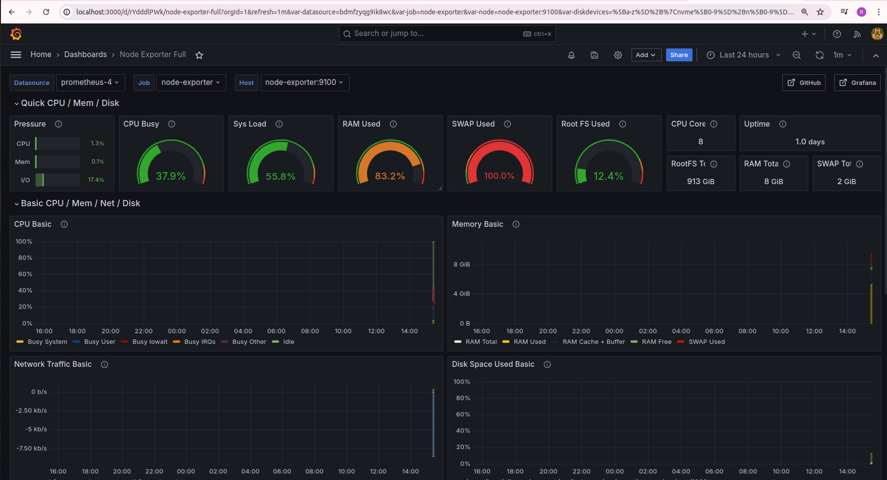
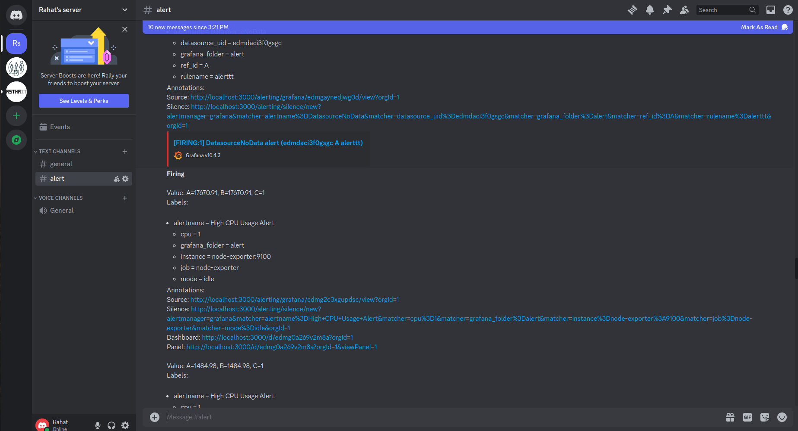
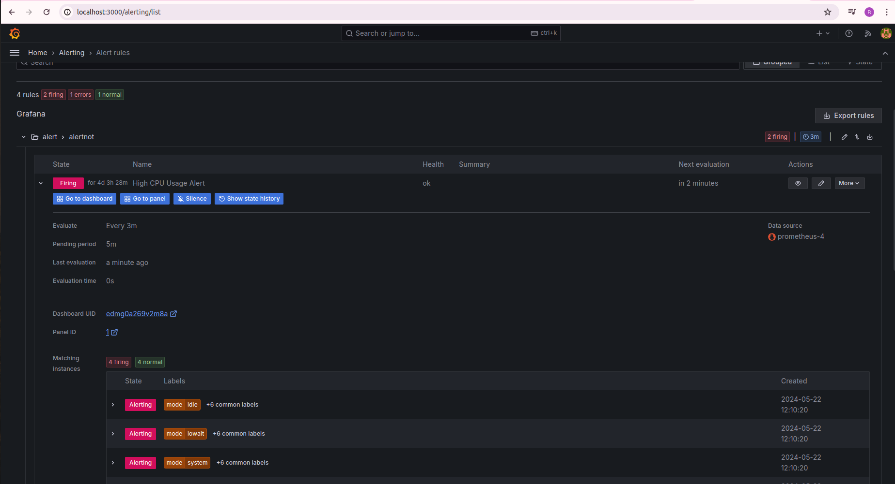

# Setting Up Alert Notifications from Grafana to Discord

This guide provides step-by-step instructions for setting up alert notifications in Grafana to send alerts to a Discord channel using a webhook.

## Prerequisites

- Access to Grafana with administrative privileges.
- A Discord account with permissions to create webhooks.
- Basic understanding of creating webhooks in Discord.

## Steps

### 1. Create a Discord Channel and Webhook

- Create a Discord channel where you want to receive alerts.
- Go to the channel settings, navigate to "Integrations", then "Webhooks".
- Create a new webhook, name it, and copy the webhook URL.

### 2. Configure Alerts in Grafana

- In Grafana, go to the "Alerting" section.
- Create or edit an alert rule.
- Set the alert condition (e.g., CPU usage > 20%).
- In the "Notifications" section, select "Webhook" and paste the Discord webhook URL.
- Configure additional settings as needed.

### 3. Set Up Alerting Policy

- Navigate to the "Alert Rules" section.
- Create a new alerting policy.
- Assign the alert rule to the policy and configure any other settings.
- Save the changes.

### Example

### Testing

- Temporarily modify the alert condition to trigger an alert.
- Verify that the alert notification is sent to the Discord channel via webhook.

## Conclusion

Follow these steps to enable alert notifications from Grafana to Discord using webhooks.
