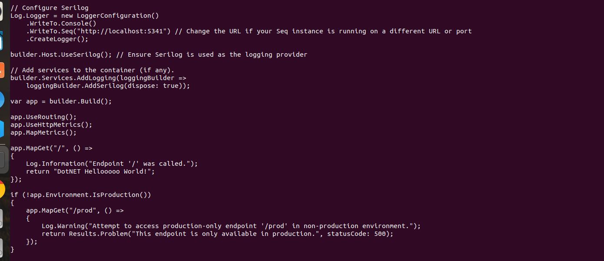
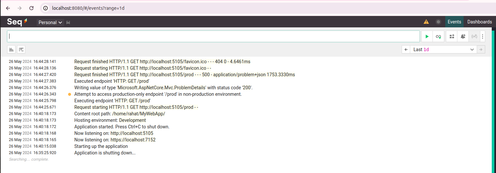

# Project Name

## Description

Brief description of the project.

## Setup

1. Ensure you have [.NET SDK](https://dotnet.microsoft.com/download) installed.
2. Clone the repository.
3. Navigate to the root directory of the project.

## Adding Serilog Packages

To get started with Serilog, you need to add the necessary packages to your .NET Core project. Run the following commands in the root of your project:

```bash
dotnet add package Serilog
dotnet add package Serilog.Sinks.Seq
dotnet add package Serilog.AspNetCore
```

## Write Logs in the code



## See the logs


