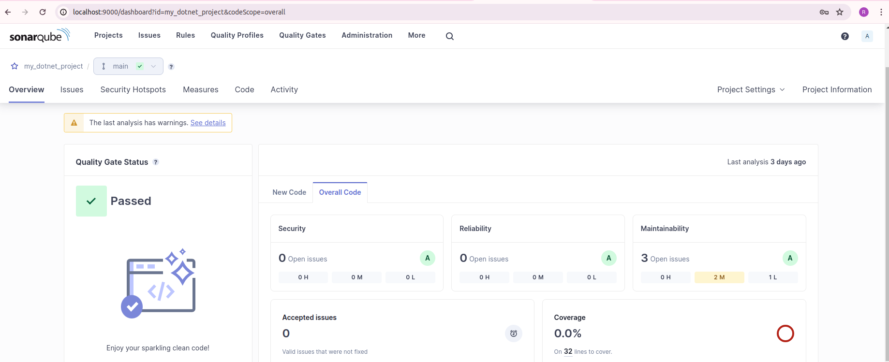

# SonarQube Integration Process

This guide outlines the step-by-step process to integrate SonarQube into your .NET project for code quality analysis.

## Step 1: Run SonarQube Container

Start the SonarQube server by running the following Docker command:

```bash
docker run -d --name sonarqube -e SONAR_ES_BOOTSTRAP_CHECKS_DISABLE=true -p 9000:9000 sonarqube:latest
```

## Step 2: Install SonarScanner .NET Global Tool

```
dotnet tool install --global dotnet-sonarscanner
```

## Step 3: Begin SonarScanner Analysis

```
dotnet sonarscanner begin /k:"<project_key>" /d:sonar.host.url="http://localhost:9000" /d:sonar.token="<authentication_token>"
```

## Step 4: Build the Project

```
dotnet build
```

## Step 5: End SonarScanner Analysis

dotnet sonarscanner end /d:sonar.token="<authentication_token>"


