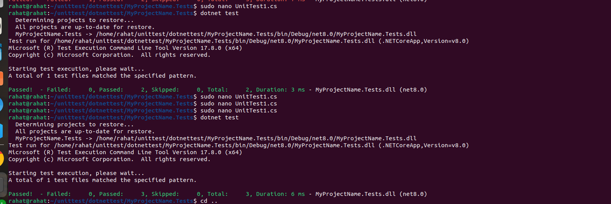

# Unit Testing Setup with xUnit

This repository contains a guide for setting up and running unit tests using xUnit in a .NET project.

## Setting Up Unit Tests

1. In the existing root folder of your project, run the following command to create a new xUnit test project:

   ```bash
   dotnet new xunit -n MyProjectName.Tests
   ```

2. Navigate to the newly created test project directory:

   ```bash
   cd MyProjectName.Tests
   ```

3. Add the required packages for testing:

   ```bash
   dotnet add package Microsoft.NET.Test.Sdk --version 17.10.0
   dotnet add package xunit --version 2.8.1
   dotnet add package xunit.runner.visualstudio --version 2.8.1
   dotnet add package coverlet.collector --version 6.0.2
   ```

4. Add a reference to the main project in your solution:

   ```bash
   dotnet add reference ../dotnettest/dotnettest.csproj
   ```

5. Write your unit test cases in the `UnitTest1.cs` file.

## Running Unit Tests

1. Restore dependencies:

   ```bash
   dotnet restore
   ```

2. Run unit tests:
   `bash
    dotnet test
    `
   

## Additional Notes

- Customize and expand your unit tests as needed to cover various scenarios and functionalities of your project.
- Utilize code coverage tools like Coverlet to measure the code coverage of your tests.
- Ensure that your unit tests provide comprehensive coverage to validate the behavior and functionality of your project.

## License

This project is licensed under the MIT License - see the LICENSE file for details.
